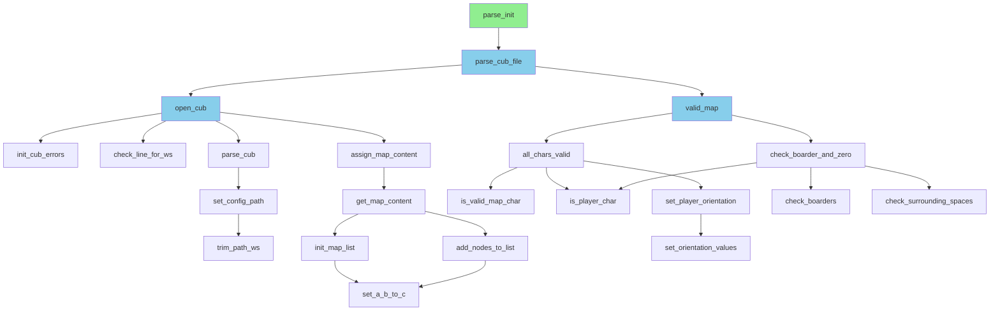

# Function Call Hierarchy - parse_init.c

## Key Flow

- **Green**: Entry point `parse_init`
- **Blue**: Three main branches
  - File I/O and config parsing (`open_cub`)
  - Map validation (`valid_map`)
  
- **Configuration parsing**: `parse_cub` → `set_config_path` → `trim_path_ws`
- **Map reading**: `assign_map_content` → `get_map_content` → list management
- **Validation**: Checks for valid characters, boarders, and surrounding spaces
